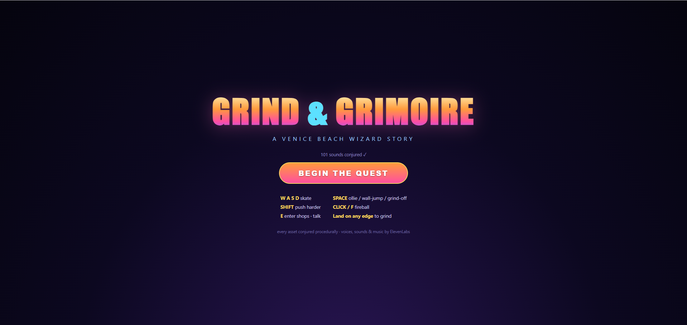
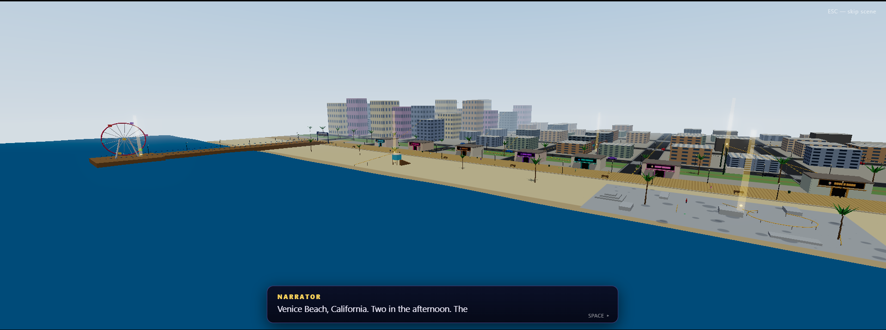
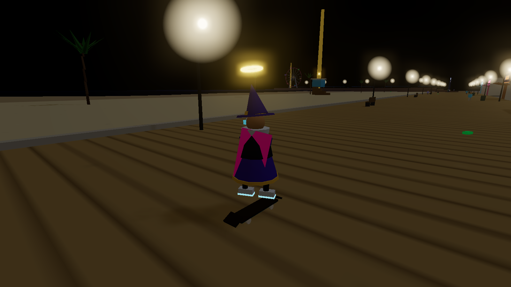
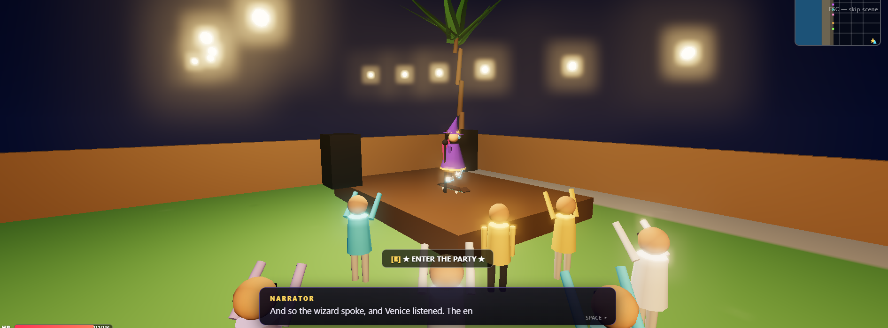

# GRIND & GRIMOIRE
*a Venice Beach wizard story*

<p align="center">
  
</p>

You are **Kai**, a skateboarding wizard with a 2 AM open-mic slot and zero poems.
Skate Venice Beach & Santa Monica from 2 PM to 2 AM, collect **12 inspiration**,
fight off boardwalk crackhead-fiends, refill your mana with little treats, buy
drip until strangers weep, and deliver the most fire spoken word the West Side
has ever heard.

<p align="center">
  
  
  <br>
  
</p>

## Run it

```bash
npm install
npm run dev      # then open http://localhost:5173
```

## Regenerate the audio (optional)

All 76 audio assets (51 voice lines, 22 SFX, 3 music tracks) were generated with
the **ElevenLabs API** (TTS, Sound Generation, and Eleven Music) into
`public/audio/`. To regenerate — e.g. after editing the script in
`src/dialogue.js` — put your key in `.env` as `ELEVENLABS_API_KEY` and run:

```bash
npm run audio    # idempotent: only generates missing files
```

## Controls

| key | action |
|---|---|
| `W A S D` | skate / steer / brake |
| `SHIFT` | push harder (stamina) |
| `SPACE` | ollie · wall-jump · hop off grinds |
| land on **any edge** | grind (rails, curbs, cars, benches, the VENICE sign…) |
| `CLICK` / `F` | fireball (12 MP) |
| `E` | enter shops · talk · party |
| `SPACE` / `ESC` | advance / skip cutscenes |

## The loop

- **MP** only refills at the five boardwalk shops (each has a story scene):
  ube latte & musubi at **Lala's Latte**, a near-death Mango Tsunami at
  **Cloud Temple**, a wasabi incident at **Poke Paradise**, a doomed basil-lime
  scoop at **Scoop Dreams**, and **Kickflip the dog** at the Booch Barn.
- **Cash** drops from vanquished fiends → buy 6 pieces of drip in 3 clothing
  shops → each piece earns exactly ONE unique stranger compliment → **EGO**
  rises (+10) → all max stats and your fireballs grow. Kai hates this.
- **Rails everywhere**: curved corner arcs, an S-curve down the green strip,
  golden roof-access rails onto real rooftops, and grindable string lights
  strung between buildings. Grinds chain smoothly through curves.
- **Traffic is real**: cars drive the avenues and WILL ragdoll you. Sometimes
  a white car appears whose driver insists that you are the dangerous one —
  she will chase you up and down the road, slamming into reverse and charging
  again, until she's hit you 3 times or gives up (she has pilates).
- **DJ Crates** on the boardwalk sells Ocean Front Heat Vol. 9 ($15). It
  replaces the soundtrack with... itself. Mercifully, it ends after a couple
  of minutes. Still no refunds.
- **Side quest**: a promoter on the pier knows about a rooftop party on the
  tallest building downtown. Meet him at the base (follow the green beam) and
  he'll get you to the top. +20 EGO, against Kai's will.
- **Inspiration** ×12: 5 shop scenes, 6 glowing shards (follow the gold beams),
  1 from your first drip. Then get to the backyard party in the northeast.
- Night falls around 8 PM. The fiends get faster. Kickflip scares them.

## Tech

- Three.js, zero downloaded assets — every model, texture, and building is
  procedural (canvas-painted ground map/facade atlas/signs, merged batched
  geometry, day-night sky shader, animated ocean, bloom).
- Grind system auto-generates rails from the top edges of every collider.
- Dialogue/cutscene engine with letterboxing, eased camera moves, and
  typewriter subtitles synced to the ElevenLabs voice lines.
- `vite.config.js` includes a dev-only `/__shot` endpoint used for automated
  visual testing (screenshots land in `shots/`).

*Written, built, art-directed & play-tested by Claude. Voices, SFX & music via ElevenLabs.*
